# AI Task Assistant - Technical System Design

## 1. Overview

AI Task Assistant is a cross-platform desktop application that helps users manage tasks and calendars with AI assistance. The system is built using Electron for cross-platform compatibility, Vue.js for the frontend framework, and Tailwind CSS for styling.

## 2. High-Level Architecture

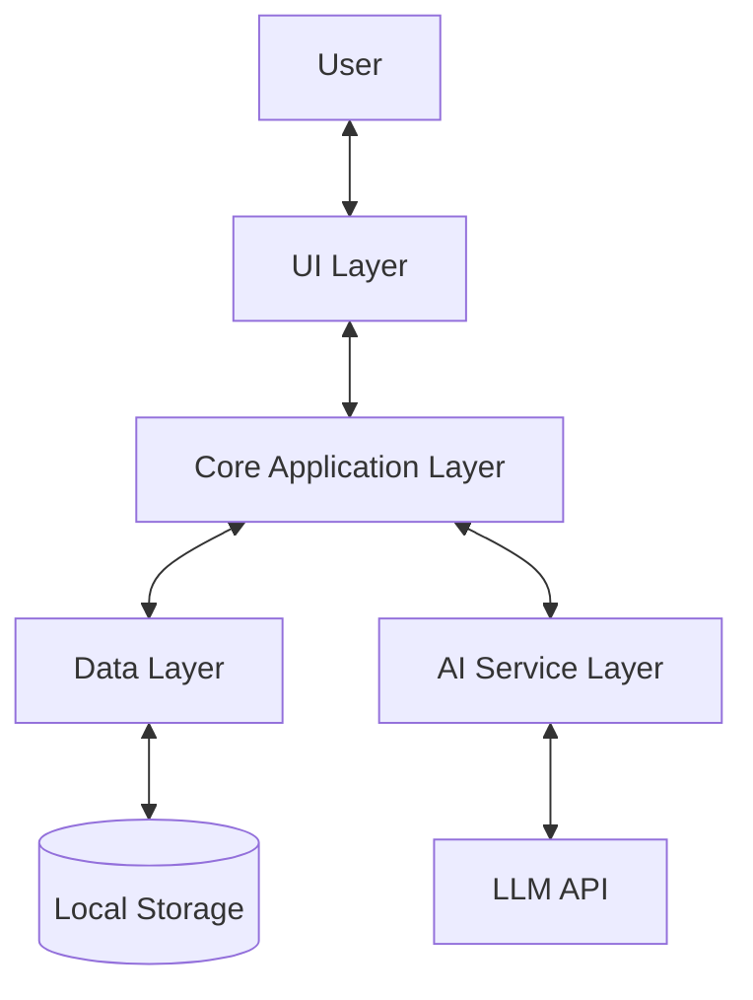

### Key Components

1. **UI Layer**: Vue.js components for user interaction
2. **Core Application Layer**: Business logic and application state management
3. **Data Layer**: Data persistence and retrieval
4. **AI Service Layer**: Interface with LLM for task analysis and management
5. **Storage**: Local database for task storage
6. **LLM API**: External AI service integration

## 3. System Architecture

### 3.1 Application Structure

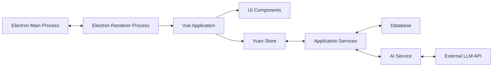

### 3.2 Component Architecture

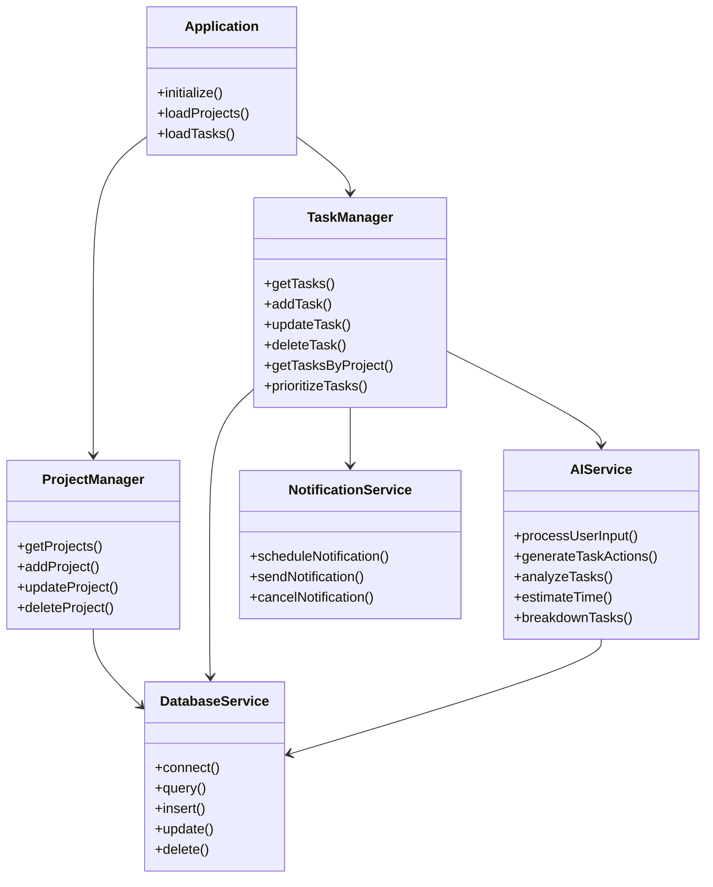

## 4. Detailed Component Design

### 4.1 Data Models

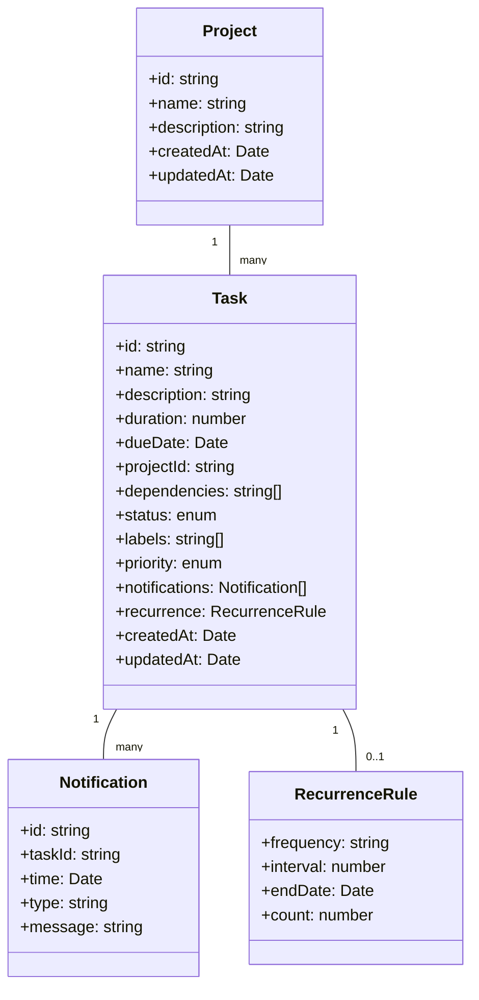

### 4.2 UI Components

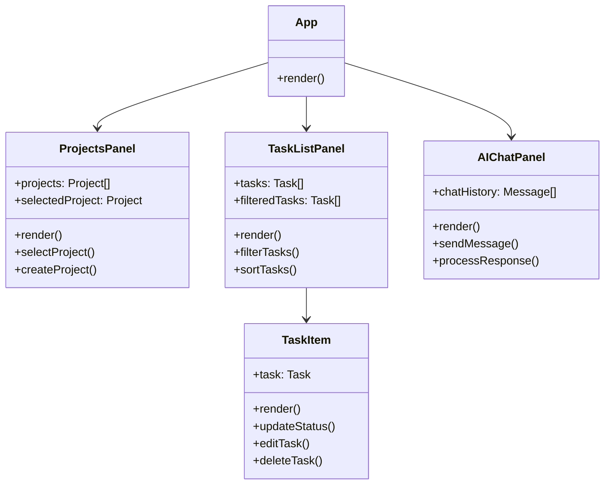

### 4.3 AI Interaction Flow

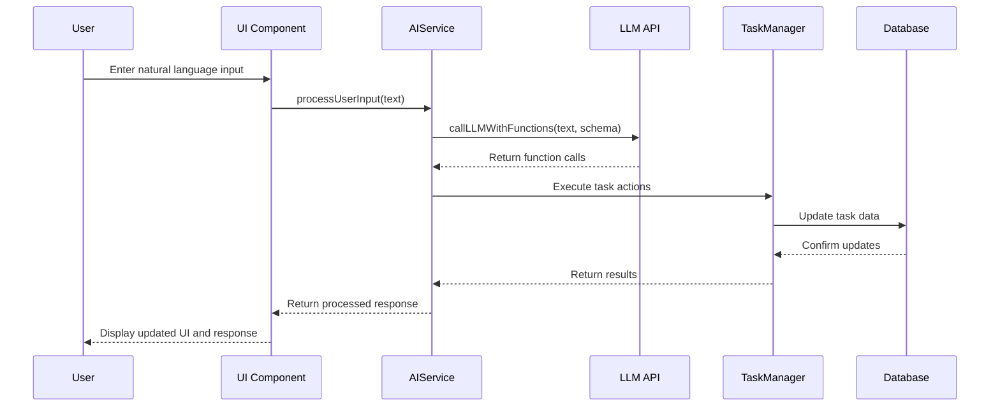

## 5. Database Design

The application will use a local SQLite database for data persistence.

### 5.1 Schema

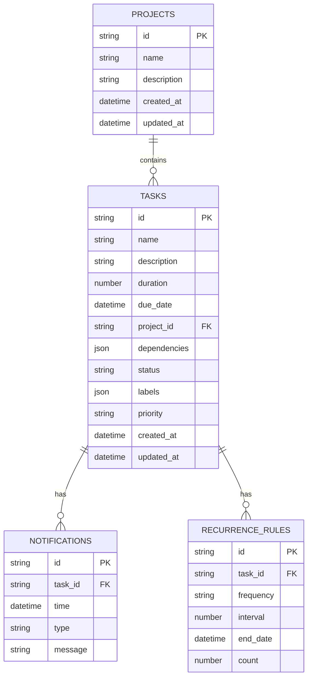

## 6. Project Structure

```
ai-task-assistant/
├── package.json
├── electron.js                 # Electron main process
├── preload.js                  # Electron preload script
├── src/
│   ├── main.js                 # Vue application entry
│   ├── App.vue                 # Root Vue component
│   ├── assets/                 # Static assets
│   │   ├── layout/             # Layout components
│   │   │   ├── AppHeader.vue
│   │   │   └── AppSidebar.vue
│   │   ├── projects/           # Project-related components
│   │   │   ├── ProjectList.vue
│   │   │   ├── ProjectItem.vue
│   │   │   └── ProjectForm.vue
│   │   ├── tasks/              # Task-related components
│   │   │   ├── TaskList.vue
│   │   │   ├── TaskItem.vue
│   │   │   ├── TaskForm.vue
│   │   │   └── TaskFilter.vue
│   │   └── ai/                 # AI-related components
│   │       ├── ChatBox.vue
│   │       ├── ChatMessage.vue
│   │       └── ChatInput.vue
│   ├── views/                  # Page views
│   │   ├── HomeView.vue
│   │   └── SettingsView.vue
│   ├── store/                  # Vuex store
│   │   ├── index.js
│   │   ├── modules/
│   │   │   ├── projects.js
│   │   │   ├── tasks.js
│   │   │   └── ai.js
│   ├── services/               # Service layer
│   │   ├── database.js         # Database service
│   │   ├── project.js          # Project service
│   │   ├── task.js             # Task service
│   │   ├── ai.js               # AI service
│   │   └── notification.js     # Notification service
│   ├── models/                 # Data models
│   │   ├── Project.js
│   │   ├── Task.js
│   │   ├── Notification.js
│   │   └── RecurrenceRule.js
│   ├── utils/                  # Utility functions
│   │   ├── dateUtils.js
│   │   ├── priorityUtils.js
│   │   └── validationUtils.js
│   └── router/                 # Vue Router
│       └── index.js
├── database/                   # Database setup
│   ├── migrations/
│   │   └── initial.js
│   └── schema.js
└── public/                     # Public assets
```

## 7. Implementation Details

### 7.1 Technologies

- **Electron**: Cross-platform desktop application framework
- **Vue.js**: Frontend framework
- **Tailwind CSS**: Utility-first CSS framework for styling
- **Vuex**: State management
- **SQLite**: Local database for data persistence
- **Electron-Store**: Simple data persistence for application settings
- **Axios**: HTTP client for API requests
- **Day.js**: Date manipulation library
- **Vue Router**: Routing for different views

### 7.2 AI Integration

The application will integrate with an LLM API (such as OpenAI's GPT) using function-calling capabilities:

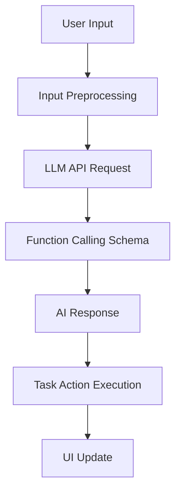

The AI service will define function schemas that match the application's task management API:

```javascript
const functionSchemas = [
  {
    name: "addTask",
    description: "Add a new task",
    parameters: {
      type: "object",
      properties: {
        name: { type: "string" },
        description: { type: "string" },
        duration: { type: "number" },
        dueDate: { type: "string", format: "date-time" },
        projectId: { type: "string" },
        priority: { type: "string", enum: ["low", "medium", "high"] },
        // Additional parameters...
      },
      required: ["name", "projectId"]
    }
  },
  // Additional function schemas...
]
```

### 7.3 Task Prioritization

The AI will prioritize tasks based on:

1. Due date proximity
2. User-set priority
3. Dependencies
4. Project importance

The prioritization algorithm will be implemented in the TaskManager service and will be accessible to the AI service.

### 7.4 Notifications

The notification system will use Electron's native notification capabilities:

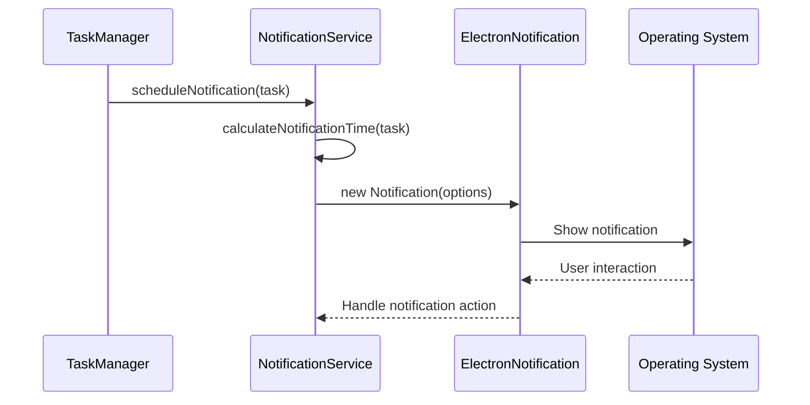

## 8. Future Enhancements (V1)

### 8.1 Calendar Integration

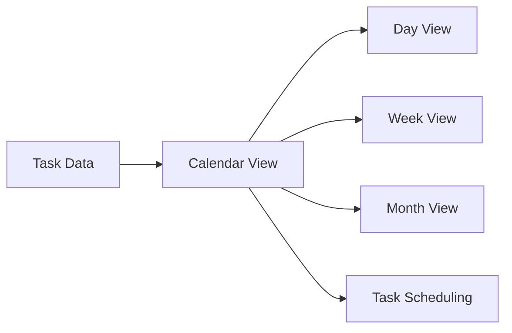

### 8.2 Voice Input

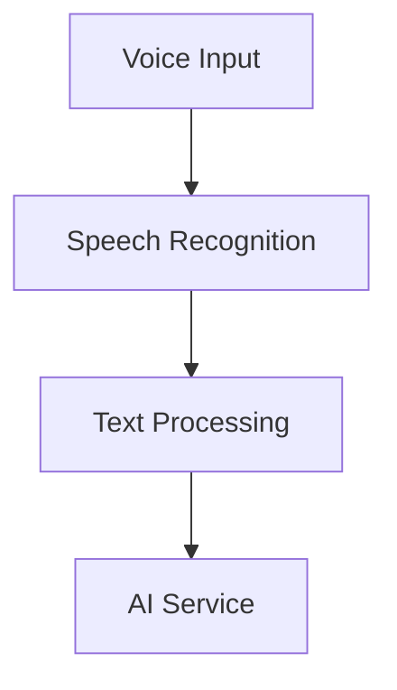

### 8.3 Enhanced AI Features

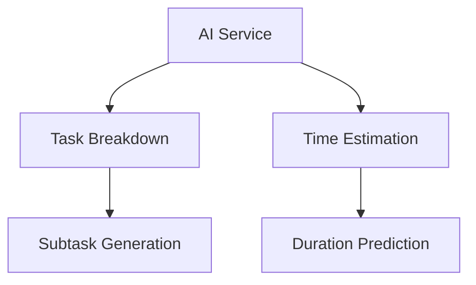

## 9. Security Considerations

1. **Data Protection**: All user data will be stored locally and encrypted
2. **API Key Security**: LLM API keys will be securely stored in the system keychain
3. **Input Validation**: All user inputs will be validated before processing
4. **Dependency Management**: Regular updates of dependencies to patch security vulnerabilities

## 10. Performance Considerations

1. **Efficient Rendering**: Optimize Vue components to minimize unnecessary re-renders
2. **Database Indexing**: Properly index the SQLite database for faster queries
3. **Lazy Loading**: Implement lazy loading for components and routes
4. **Caching**: Cache AI responses for similar queries to reduce API calls
