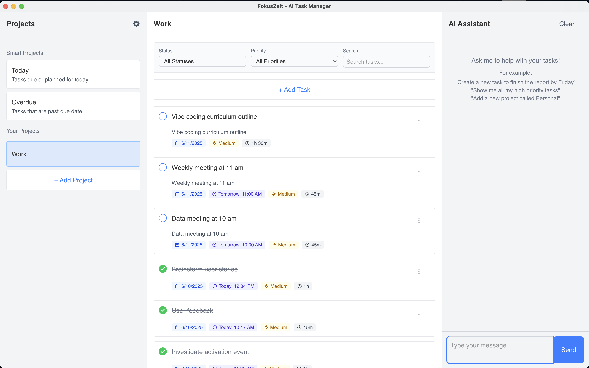

# FokusZeit - AI Task Assistant



FokusZeit is an intelligent productivity to-do app that uses AI to manage your tasks and projects. It offloads task creation, editing, and planning to an LLM, making your workflow smoother and more efficient. Compatible with OpenAI and local LLM APIs.

## Getting Started

```bash
# Install dependencies
cd app
npm install

# Run Electron in development mode
npm run electron:dev

# Build Electron application
npm run electron:build
```

## AI Integration Guide

Setting up the AI assistant is simple:

- Navigate to settings and configure your base URL, API key, and preferred model
- Supports both cloud-based LLM APIs like OpenAI and local OpenAI-compatible endpoints like LMStudio or Ollama
- Interact naturally with the AI to manage projects, tasks, and notifications

### LMStudio Configuration Example

- API key: lm-studio  
- API URL: [http://localhost:1234/v1/chat/completions](http://localhost:1234/v1/chat/completions)  
- Model name: qwen/qwen3-4b 

### OpenAI Configuration Example

- API key: your-api-key  
- API URL: [https://api.openai.com/v1/chat/completions](https://api.openai.com/v1/chat/completions)
- Model name: gpt-4o-mini  

## Current Features

- **Task Management**: Create, read, update, and delete tasks with ease
- **Project Organization**: Group tasks by project with smart "Today" and "Overdue" collections
- **Notifications**: Stay on top of your priorities with notifications for your tasks
- **AI Assistant**: Chat naturally to manage your tasks/projects/notifications
- **Smart Scheduling**: Automatically plan your daily schedule
- **Customizable Settings**: Configure AI settings and define your working hours
- **Progress Bar**

## Roadmap

### Coming in V1

- **Enhanced UI**: Calendar-based task visualization
- **Voice Input**: Speak directly to your AI assistant
- **Advanced AI Features**: Task breakdown and more intelligent assistance
- **Keyboard Shortcuts**: Boost your productivity
- **Drag & Drop**: Easily move tasks between projects

### Future Enhancements

- **Advanced Settings**: Time zone, time format, week setting, daily workload, light/dark themes, scheduling gaps, alert settings, and internationalization
- **Productivity Rituals**: Daily & weekly structured & AI-guided planning and review sessions
- **Focus Mode**: Distraction-free work with time tracking
- **Third-party Integrations**: Connect with your favorite calendars
- **Email Notifications**: Stay informed even when away

## Contributing

We welcome contributions from developers of all skill levels! Here's how you can help:

### Project Setup

1. Fork the repository
2. Create a feature branch (`git checkout -b feature/amazing-feature`)
3. Make your changes
4. Run tests (`npm run test`)
5. Commit your changes (`git commit -m 'Add some amazing feature'`)
6. Push to your branch (`git push origin feature/amazing-feature`)
7. Open a Pull Request

### Development Guidelines

- Write tests for new functionality
- Update documentation as needed
- Respect the existing architecture and patterns

### Suggestions Welcome

- Suggestions for UI, UX and functionalities are welcome. Pleas leave a message in discussions section.
