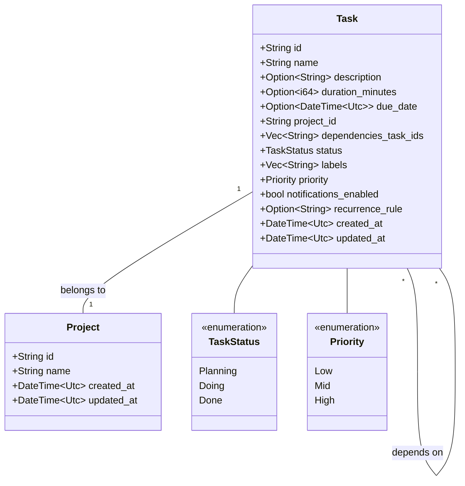
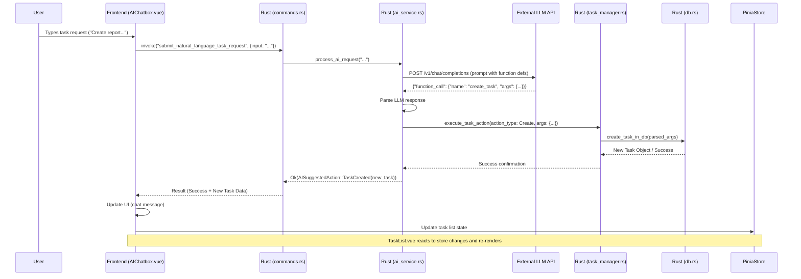

# AI Task Assistant - Technical System Design

## 1. Overview

The AI Task Assistant is a cross-platform desktop application designed to help users manage their to-do items and calendars efficiently. It leverages a Large Language Model (LLM) to understand natural language inputs for task creation, editing, and planning. The system prioritizes a decoupled architecture for maintainability and future scalability.

## 2. Guiding Principles

*   **Cross-Platform Compatibility**: Achieved through Tauri, allowing the application to run on Windows, macOS, and Linux from a single codebase.
*   **Decoupled Components**: Each major part of the system (UI, core logic, data storage, AI interface) will be designed with clear interfaces and minimal dependencies on others. This promotes independent development, testing, and modification.
*   **Modern UI/UX**: Vue.js for reactive UI components and Tailwind CSS for utility-first styling will ensure a modern and responsive user experience.
*   **Rust-Powered Backend**: Tauri's Rust backend will handle core logic, data manipulation, and interactions with the OS, ensuring performance and security.
*   **AI-Driven Interactions**: LLM function-calling will be central to task management, providing an intuitive and intelligent user experience.
*   **Local-First Data**: User data will primarily reside locally for privacy and offline access.

## 3. High-Level Architecture

The system will adopt a layered architecture with clear separation of concerns. We can visualize this as a variation of a Model-View-ViewModel (MVVM) pattern, adapted for Tauri's frontend-backend communication.

*   **Frontend (View & ViewModel)**: Built with Vue.js and Tailwind CSS. Responsible for rendering the UI and handling user interactions. ViewModel logic within Vue components will manage UI state and communicate with the backend via Tauri's command system.
*   **Backend (Model & Core Logic)**: Implemented in Rust. Exposes commands that the frontend can invoke. This layer contains:
    *   **Command Handlers**: Functions exposed to the Tauri frontend.
    *   **Core Business Logic**: Manages tasks, projects, prioritization, and other application-specific rules.
    *   **AI Service Interface**: Handles communication with the LLM.
    *   **Data Access Layer**: Interacts with the chosen data storage solution.
*   **AI Integration Layer**: A module (likely in Rust) responsible for formatting prompts, calling the LLM API, and parsing its responses (function calls).
*   **Data Storage**: Local storage for tasks, projects, and settings.

```
### Component Diagram (Mermaid)

```mermaid
graph TD
    User --> Frontend[Frontend (Vue.js + Tailwind CSS in Tauri WebView)]

    subgraph Tauri Application
        Frontend -- Tauri IPC (Commands/Events) --> Backend
        Backend[Rust Backend]
    end

    subgraph Backend Components
        Backend --> CommandHandlers[Command Handlers]
        CommandHandlers --> CoreLogic[Core Business Logic]
        CoreLogic --> AIService[AI Service Interface]
        CoreLogic --> DataAccessLayer[Data Access Layer]
        AIService --> LLM_API[External LLM API]
        DataAccessLayer --> DataStore[Local Data Store (e.g., SQLite/JSON)]
    end

    Frontend --> UI_Components[UI Components: Left Panel, Task List, Chatbox]
```

## 4. Technology Stack

*   **Application Framework**: [Tauri](https://tauri.app/) - For building cross-platform desktop applications with a Rust backend and web frontend.
*   **Frontend Language/Framework**: [Vue.js 3](https://vuejs.org/) (Composition API) - For building reactive and modular UI components.
*   **Frontend Styling**: [Tailwind CSS](https://tailwindcss.com/) - A utility-first CSS framework for rapid UI development.
*   **Backend Language**: [Rust](https://www.rust-lang.org/) - For performance, safety, and system-level interactions.
*   **State Management (Frontend)**: [Pinia](https://pinia.vuejs.org/) or Vue's built-in reactivity, suitable for managing shared state across Vue components.
*   **AI Integration**: HTTPS client in Rust (e.g., `reqwest`) to interact with LLM APIs.
*   **Data Storage**:
    *   **Primary**: SQLite (via a Rust crate like `rusqlite`) for structured, relational data (tasks, projects). Offers robustness and querying capabilities.
    *   **Configuration/Simple Storage**: JSON files for user preferences or simpler, non-relational data if needed.
*   **Diagramming**: Mermaid.js for embedding diagrams in Markdown.

## 5. Detailed Component Design

### 5.1. Frontend (Vue.js, Tailwind CSS, Tauri WebView)

The frontend is responsible for all user-facing elements and interactions.

*   **Structure**:
    *   `main.js` (or `main.ts`): Initializes Vue app, mounts root component.
    *   `App.vue`: Root Vue component, sets up main layout.
    *   `components/`: Directory for reusable Vue components.
        *   `ProjectList.vue`: Left panel displaying projects.
        *   `TaskList.vue`: Middle panel displaying tasks for the selected project.
        *   `TaskItem.vue`: Individual task representation.
        *   `AIChatbox.vue`: Right panel for AI interaction.
        *   `NotificationBar.vue`: For displaying app notifications.
    *   `views/` (or `pages/`): Top-level components representing different "pages" or main views (though for MVP, it might be a single main view).
    *   `router/`: Vue Router setup if multiple views/pages are needed beyond MVP. (For MVP's single main view, this might be overkill initially).
    *   `store/`: Pinia stores for managing global state (e.g., current project, task list, AI interaction state).
*   **Tauri Integration**:
    *   Uses `@tauri-apps/api/tauri` for invoking Rust commands (`invoke`).
    *   Uses `@tauri-apps/api/event` for listening to events emitted from the Rust backend (e.g., data updates, notifications).
*   **Styling**: Tailwind CSS utility classes will be used directly in Vue components. A base `tailwind.config.js` will be set up, and potentially a global CSS file (`src/assets/css/main.css`) for base styles or custom component styles if needed.
*   **UI Components (as per PRD)**:
    *   **Left Panel (Projects)**: `ProjectList.vue` - Fetches and displays projects. Allows project selection.
    *   **Middle Panel (Text-based Task List)**: `TaskList.vue` - Displays tasks for the currently selected project. Allows sorting and filtering (basic for MVP). Each task rendered by `TaskItem.vue`.
    *   **Right Panel (AI Chatbox)**: `AIChatbox.vue` - Text input for natural language commands. Displays AI responses/clarifications. Manages the conversation flow.

### 5.2. Backend (Rust - Tauri Commands & Core Logic)

The Rust backend handles all business logic, data persistence, and AI communication.

*   **`src-tauri/src/main.rs`**: Entry point for the Tauri application. Defines commands and sets up the application.
*   **Modules**:
    *   `commands.rs`: Defines all `#[tauri::command]` functions callable from the frontend. These act as the API layer for the frontend.
        *   Example commands: `add_task_ai`, `view_tasks`, `edit_task_ai`, `remove_task_ai`, `get_projects`, `set_daily_prioritization`.
    *   `models.rs`: Defines data structures (structs) for `Task`, `Project`, etc. These structs will derive `Serialize` and `Deserialize` from `serde` for easy IPC with the frontend.
    *   `db.rs` (or `data_access.rs`): Handles all database interactions (CRUD operations for tasks and projects using SQLite).
    *   `ai_service.rs`: Manages interaction with the LLM.
        *   Formats prompts based on user input and task context.
        *   Sends requests to the LLM API.
        *   Parses LLM responses, especially structured data from function-calling.
    *   `task_manager.rs`: Core business logic for managing tasks (e.g., applying updates, handling dependencies, status changes, prioritization logic).
    *   `notifications.rs`: Logic for triggering and managing notifications (for MVP, this might be simple desktop notifications via Tauri's API).
*   **Error Handling**: Consistent error types and handling throughout the Rust modules, propagating errors appropriately to the frontend so they can be displayed to the user.
*   **State Management**: Application state (like database connections) will be managed using Tauri's managed state.

### 5.3. AI Integration (Rust `ai_service.rs`)

This component is crucial for the AI-driven features.

*   **LLM Interaction**:
    *   Uses an HTTP client like `reqwest` to make API calls to the chosen LLM.
    *   API keys and endpoint URLs will be configurable (e.g., via environment variables or a configuration file, not hardcoded).
*   **Prompt Engineering**:
    *   Develop well-structured prompts that guide the LLM to use the defined function-calling capabilities.
    *   Prompts will include:
        *   User's natural language input.
        *   Current context (e.g., selected project, existing tasks if relevant).
        *   Definitions of available functions (e.g., `create_task`, `update_task`, `delete_task`, `view_tasks`).
*   **Function Call Handling**:
    *   The LLM is expected to return a "function call" object specifying the function name and arguments.
    *   The `ai_service.rs` will parse this object.
    *   Based on the function name, it will invoke the corresponding methods in `task_manager.rs` or `db.rs`.
    *   Example: If LLM returns a call to `create_task` with details, `ai_service.rs` will call a Rust function like `task_manager::create_new_task(name, description, ...)`

### 5.4. Data Models & Storage

#### Data Models (in `models.rs`)

```rust
// In src-tauri/src/models.rs
use serde::{Serialize, Deserialize};
use chrono::{DateTime, Utc, Duration}; // For date/time and duration

#[derive(Debug, Serialize, Deserialize, Clone)]
pub enum TaskStatus {
    Planning,
    Doing,
    Done,
}

#[derive(Debug, Serialize, Deserialize, Clone)]
pub enum Priority {
    Low,
    Mid,
    High,
}

#[derive(Debug, Serialize, Deserialize, Clone)]
pub struct Task {
    pub id: String, // Or i64 if using SQLite autoincrement, but String allows for UUIDs
    pub name: String,
    pub description: Option<String>,
    pub duration: Option<i64>, // Duration in minutes or seconds
    pub due_date: Option<DateTime<Utc>>,
    pub project_id: String, // Foreign key to Project
    pub dependencies: Vec<String>, // List of Task IDs
    pub status: TaskStatus,
    pub labels: Vec<String>,
    pub priority: Priority,
    pub notifications_enabled: bool, // Simplified notification flag
    pub recurrence_rule: Option<String>, // e.g., RRULE string
    pub created_at: DateTime<Utc>,
    pub updated_at: DateTime<Utc>,
}

#[derive(Debug, Serialize, Deserialize, Clone)]
pub struct Project {
    pub id: String, // Or i64
    pub name: String,
    pub created_at: DateTime<Utc>,
    pub updated_at: DateTime<Utc>,
}
```

#### Data Model Mermaid Class Diagram



#### Data Storage (SQLite via `db.rs`)

*   **Database Schema**:
    *   `projects` table (`id` PK, `name`, `created_at`, `updated_at`)
    *   `tasks` table (`id` PK, `name`, `description`, `duration`, `due_date`, `project_id` FK, `dependencies` (store as JSON string or separate link table), `status`, `labels` (JSON string), `priority`, `notifications_enabled`, `recurrence_rule`, `created_at`, `updated_at`)
*   **`db.rs` Responsibilities**:
    *   Initialize database connection (e.g., using `tauri_plugin_sql` or `rusqlite` directly).
    *   Provide functions for all CRUD operations on tasks and projects.
    *   Handle data migrations if the schema evolves.
    *   Convert data between Rust structs and database rows.

## 6. API Design (Tauri Commands)

These are Rust functions exposed to the Vue.js frontend. They form the primary API between the frontend and backend.

```rust
// Potential signatures in src-tauri/src/commands.rs

// Project related commands
#[tauri::command]
async fn get_projects(state: tauri::State<'_, AppState>) -> Result<Vec<Project>, String>;

#[tauri::command]
async fn add_project(name: String, state: tauri::State<'_, AppState>) -> Result<Project, String>;

// Task related commands (some driven by AI, some direct)
#[tauri::command]
async fn get_tasks_for_project(project_id: String, state: tauri::State<'_, AppState>) -> Result<Vec<Task>, String>;

#[tauri::command]
async fn submit_natural_language_task_request(
    user_input: String,
    current_project_id: Option<String>, // Context for the AI
    state: tauri::State<'_, AppStateContainer> // Contains AppState like DB connection pool and AI client
) -> Result<AISuggestedAction, String>; // AISuggestedAction could be enum: TaskCreated, TaskUpdated, ClarificationNeeded etc.

// Direct CRUD (might be used internally by AI handler or for simpler UI interactions if any)
#[tauri::command]
async fn create_task_direct(task_data: Task, state: tauri::State<'_, AppState>) -> Result<Task, String>;

#[tauri::command]
async fn update_task_direct(task_id: String, task_data: Task, state: tauri::State<'_, AppState>) -> Result<Task, String>;

#[tauri::command]
async fn delete_task_direct(task_id: String, state: tauri::State<'_, AppState>) -> Result<(), String>;

// Other commands
#[tauri::command]
async fn get_daily_prioritized_tasks(state: tauri::State<'_, AppState>) -> Result<Vec<Task>, String>;

// This is a simplified representation. `AppState` would hold db connections, AI client, etc.
// `AISuggestedAction` would be a struct/enum representing the AI's parsed intent.
```

The `submit_natural_language_task_request` command is key. It takes the user's text, sends it to `ai_service.rs`, which processes it with the LLM. The LLM's function call output is then translated into actions on the tasks (e.g., calling internal Rust functions that correspond to `create_task_direct`, `update_task_direct`, etc.). The frontend then receives a result indicating success or what UI updates are needed.

## 7. Key Workflows & Diagrams

### 7.1. User Creates a Task via AI Chatbox

1.  User types "Create a task: 'Write report for Q3 results' due tomorrow, high priority" into the `AIChatbox.vue`.
2.  `AIChatbox.vue` invokes the `submit_natural_language_task_request` Tauri command with the input string.
3.  The Rust `submit_natural_language_task_request` function in `commands.rs` passes the input to `ai_service.rs`.
4.  `ai_service.rs` constructs a prompt including the user input and function definitions for task operations (e.g., `create_task(name, due_date, priority, ...)`).
5.  `ai_service.rs` sends the prompt to the LLM API.
6.  LLM API processes the prompt and returns a JSON object indicating a function call, e.g., `{"function_name": "create_task", "arguments": {"name": "Write report for Q3 results", "due_date": "YYYY-MM-DD", "priority": "High"}}`.
7.  `ai_service.rs` parses this JSON.
8.  `ai_service.rs` (or `task_manager.rs` called by it) validates the arguments and calls the appropriate function in `db.rs` to create the task in the SQLite database.
9.  Upon successful creation, `db.rs` returns the new `Task` object.
10. The `submit_natural_language_task_request` command returns a success result (e.g., `AISuggestedAction::TaskCreated(new_task)`) to the frontend.
11. The frontend (`AIChatbox.vue` and relevant Pinia stores) updates the UI:
    *   Shows a confirmation message in the chatbox.
    *   The `TaskList.vue` (if viewing the relevant project) refreshes to display the new task. This can be achieved by the command also emitting an event like `task-created` that the frontend listens to, or by the Pinia store reacting to the command's successful result.

#### Sequence Diagram: AI Task Creation



## 8. Decoupling and Modularity Strategies

*   **Clear API Boundary (Tauri Commands)**: The frontend interacts with the backend *only* through well-defined Tauri commands. This is the primary decoupling point between UI and business logic.
*   **Service Layers in Rust**: The Rust backend is structured into services/modules with distinct responsibilities (e.g., `ai_service`, `db_service`, `task_manager`).
    *   `commands.rs` acts as a facade, delegating to these services.
    *   Services interact with each other through well-defined function calls, not direct data manipulation across module boundaries where possible.
*   **Data Models (`models.rs`)**: Shared data structures (`Task`, `Project`) are defined centrally and used for communication. `serde` ensures consistent serialization/deserialization.
*   **Event-Driven Updates (Optional but Recommended)**: For UI updates that don't directly result from a command's return value, the Rust backend can emit events (e.g., `task-updated`, `project-deleted`) that the frontend listens to. This decouples the specific action from the UI's reaction.
    *   Example: If a background process updates a task, it can emit an event, and `TaskList.vue` can listen and refresh.
*   **Vue Component Modularity**: Vue's component-based architecture naturally promotes UI modularity. Props and events are used for parent-child communication. Pinia stores for cross-component state.
*   **AI Service Abstraction**: The `ai_service.rs` module abstracts away the specifics of the LLM API. If the LLM provider changes, only this module needs significant updates.
*   **Database Abstraction**: `db.rs` abstracts database interactions. If the database technology were to change (e.g., from SQLite to something else, though less likely for a local app), the changes would be mostly contained within this module.

## 9. Notifications

*   **MVP**:
    *   In-app notifications for task creation/updates/reminders.
    *   Utilize Tauri's `Notification` API for desktop notifications.
    *   The `notifications.rs` module in Rust will be responsible for determining when a notification should be triggered (e.g., task due soon).
    *   A simple check could run periodically or when tasks are loaded/updated to see if any notifications are due.
*   **Triggering**:
    *   When a task with `notifications_enabled: true` is approaching its `due_date`.
    *   After AI successfully creates or modifies a task, a confirmation notification.
*   **Frontend Display**:
    *   Desktop notifications will appear via OS.
    *   A `NotificationBar.vue` component could display transient in-app messages.

## 10. Future Considerations (V1 Features from PRD)

The current architecture should provide a solid foundation for V1 features:

*   **Calendar-based UI**:
    *   Frontend: A new Vue component/view for the calendar. It will fetch tasks (potentially with date range filters via new Tauri commands) and display them.
    *   Backend: May require new query capabilities in `db.rs` (e.g., fetch tasks within a date range).
*   **Voice Input**:
    *   Frontend: Integrate a JavaScript library for voice-to-text (e.g., Web Speech API if usable within Tauri, or a dedicated JS library).
    *   The transcribed text would then be fed into the `AIChatbox.vue` as if typed.
    *   Alternatively, Tauri plugins or Rust crates could provide more native OS-level voice recognition.
*   **Enhanced AI Features**:
    *   **Task Breakdown**:
        *   AI Service: New function definition for `breakdown_task(task_description)`.
        *   LLM needs to return a list of sub-tasks.
        *   Backend: Logic to create multiple new tasks from the LLM response, possibly linking them.
    *   **Time Estimation**:
        *   AI Service: Modify prompts or add a new function `estimate_task_duration(task_description)`.
        *   LLM returns estimated duration.
        *   Backend: Update the `duration` field of the `Task`.
*   **Other Notifications (Email)**:
    *   Backend: Integrate an email sending library in Rust (e.g., `lettre`).
    *   Requires user configuration for email settings (SMTP server, credentials securely stored).
    *   `notifications.rs` would be extended to handle email sending.

This design emphasizes a separation of concerns, making it easier to integrate these future features by adding new modules/functionality or extending existing ones without requiring a full rewrite of core components.
